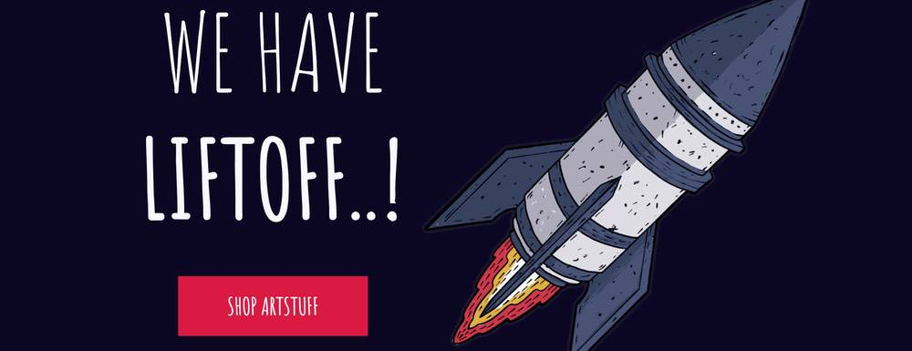

<small><i><a href='http://ecotrust-canada.github.io/markdown-toc/'>Table of contents generated with markdown-toc</a></i></small>

=====

# **RJW ARTSTUFF**

## **INTRODUCTION**
This **fifth and final Portfolio Project** is the product of combined knowledege and techniques from all modules of the ***Code Institute Full Stack Developer Course*** to date, culminating in the creation of this **E-Commerce Applications project**. 

**RJW ARTSTUFF** allows users to shop original artwork and illustration products from **UK tradigital artist**, ***RJW***. The e-commerce portal offers a range of *quality printed original artworks and garments* at affordable prices, in addition to *artist commissions and custom original art* at competitive rates.

A live version of the site can be found [here](https://pp05-rjw-artstuff.herokuapp.com/)

### **PROJECT FUNCTIONALITY**
The application uses **Django 3** to encourage rapid development, by utilising a *model-template-view* approach.
In conjunction with **Django**, **sqlite** was used in the Project's inception phase as a database for local testing. **Sqlite** is self-contained highly reliable, SQL database engine that includes all the normal relational database management features. Later, development was switched to **ElephantSQL**, to ensure any data entered was visible in the deployed application. **ElephantSQL** provides an open-source, fully technical and easy-to-use object-relational database management system.

The project is version controlled via **Git** & **Github** and is deployed via **Heroku**. All environment & secret variables are stored in an `env.py` file, which is then held in a `.git-ignored` file, ensuring project integrity is held to a high security standard, in relation to project and present day requirements.

Using **Django** and the above Database methods the **site owner**, as an administrator for the application, has complete access to a custom Admin dashboard where they can ***Create***, ***Read***, ***Update*** and ***Delete*** records for each of the application models as appropriate. In-built functionality also ensures the ability to maintain, add to, delete and curate the database from directly within the **RJW ARTSTUFF** website, via the ***Product Management*** link. Client-facing ***CRUD functionality*** is provided to **registed site users** through the ability to ***create***, ***read***, ***update*** and ***delete*** feedback on any product on the site. Finally, a **Connect** page provides users with the opportunity to initiate their own *custom art project* by completeing a ***contact form***, in addition to a ***newsletter subscription*** link, where they can choose to subscribe to the **RJW ARTSTUFF** newsletter. 

To this end, please ensure when using the site to test the full **CRUD funcionality** of this application, **please log in as site owner, RJW:** 

| IS STAFF? | USER | EMAIL | PASSWORD | IS SUPERUSER? |
|-----|-----|-----|-----|-----|
| ***YES*** | ***rjw*** | **rjw.illustration@gmail.com** | **rian0592** | ***YES*** |

----

# **UCD Phase 1: STRATEGY** 

## **PROJECT GOALS**

This project will aim to provide **users** with a *smooth and stylish e-commerce portal*, where they are able to search and purchase ***original custom artworks*** and ***garments*** by **tradigital UK artist *RJW***. A secondary service proposition is also to be offered, where **users** - registered or unregistered - have the ability to *commission their own custom artworks*. The site will also allow the **site owner** to *create, read, update and delete product data records* for the **RJW ARTSTUFF** website directly through the browser.

Base styling and project setup relies mainly on **Django**, **Bootstrap** and borrows from **Code Institute's** *Boutique Ado* project, with the addition of three custom models; ***Feedback***, ***Contact*** and ***Newsletter***. Full *non-superuser CRUD functionality* is demonstrated in the ability for **registered site users** to create, update and delete ***feedback*** on any product, and *manage their posted feedbacks* through a dedicated ***My Feedback*** page. The **site owner** has full *CRUD functionality* to create, update and delete Product data directly through their browser, without a need to access the Admin Panel. 

## **USER STORIES:**

A **GitHub** classic kanban project board was utilised throughout to log all ***User Stories*** necessary to meet MVP requirements, track their progress and manage the project. This helped keep focus by moving them, in manageable batches, through *lanes*; from *"to do"* through *"in progress"* into ***"done"***, as they were completed.

All other **Kanban** screens [**here**](static/readme/kanban/).

***Milestone/Sprint One User Stories***

- USER STORY #05: Account Registration
As an unregistered user I can easily register for an account so that I can shop more conveniently on future visits.

- USER STORY #04: View Purchase Total
  As an unregistered user I can easily view my purchase total at any time so that I can see my current total & avoid overspending.

- USER STORY #06: Account Login / Logout
  As a registered user I can login or logout easily so that I can securely access my personal account info.

- USER STORY #07: Account Password Recovery
  As a registered user I can recover my password if I forget it so that I can easily regain access to my account.

***Milestone/Sprint Two User Stories***

- USER STORY #01: View List of Items
  As an unregistered user I can view a list of items available to purchase so that I can select items to purchase.

- USER STORY #02: View Item Details
  As an unregistered user I can view specific item details so that I can see the price, description, image, rating & available options of certain items I'm interested in.

- USER STORY #03: View Deal and Offer Items
  As an unregistered user I can easily identify new items, current deals & special offers so that I can shop the latest items or benefit from special savings on items.

***Milestone/Sprint Three User Stories***

- USER STORY #13: Search for Specific Items
  As a registered or unregistered user I can search items by name or description so that I can find specific items to purchase.

- USER STORY #14: View Searches & Results
  As a registered or unregistered user I can easily view searched items & the results so that I can easily check if items are available.

***Milestone/Sprint Four User Stories***

- USER STORY #10: Sort List of Available Items
  As a registered or unregistered user I can sort a list of the available items so that I can view categorically-sorted list to easily identify best-rated or best-priced items.

- USER STORY #11: Sort Items By Specific Category
  As a registered or unregistered user I can sort items by specific category so that I can view category-specific best-rated or best-priced items.

- USER STORY #12: Sort Multiple Categories Simultaneously
  As a registered or unregistered user I can sort multiple categories simultaneously so that I can find best-rated or best-priced items across broad categories of items, e.g. 'artwork' or 'artwear'.

***Milestone/Sprint Five User Stories***

- USER STORY #15: Checkout - Item Options & Quantity
  As a registered or unregistered user I can easily select options & quantity of items when buying so that I can ensure the correct product/quantity/options are selected.

- USER STORY #16: Checkout - View Bag Items
  As a registered or unregistered user I can view items in bag to be purchased so that I can see the total cost of purchases & all items to be received.

- USER STORY #17: Checkout - Adjust Bag Quantities
  As a registered or unregistered user I can easily adjust quantities of items in bag so that I can easily make changes to basket items before checkout.

***Milestone/Sprint Six User Stories***

- USER STORY #18: Easy Purchase Process
  As a registered or unregistered user I can easily complete the purchase process so that I can checkout quickly and hassle-free.

- USER STORY #19: Checkout - View Order Confirmation
  As a registered user I can view an order confirmation after checkout so that I can check there are no mistakes.

- USER STORY #20: Checkout - Receive Email Confirmation
  As a role I can receive email confirmation after checkout so that I can keep a confirmation of order details for my own records.

***Milestone/Sprint Seven User Stories***

- USER STORY #08: Account Registration Verification Email
  
As a registered user I can receive an email confirming account registration so that I can verify account registration was successful.

- USER STORY #09: Account User Profiles
  As a registered user I can access a personalised user profile so that I can save personal & payment info, view personal order history/order confirmations.

***Milestone/Sprint Eight User Stories***

- USER STORY #21: Admin - Add New Items
  As the site owner I can create/add new items so that I can add new products to the site.

- USER STORY #22: Admin - Update Items
  As the site owner I can update/edit existing items so that I can easily change an item's price, description, image & other criteria.

- USER STORY #23: Admin - Delete Items
  As the site owner I can delete items so that I can easily remove items no longer for sale.

***Milestone/Sprint Nine User Stories***

- USER STORY #24: Feedback - Create Comment / Review
  As a registered user I can create a comment/review on items I purchase so that I can leave feedback for other users on purchased items.

- USER STORY #25: Feedback - Update Comment / Review
  As a registered user I can update/edit comments/reviews I have previously created so that I can easily amend comments/reviews for purchased items.

- USER STORY #26: Feedback - Delete Comment / Review
  As a registered user I can delete comments/reviews I have previously created so that I can easily remove comments/reviews for purchased items.

- USER STORY #27: Feedback - Manage All Comments / Reviews
  As a registered user I can easily view a summary of my comments/reviews so that I can easily view & manage comments/reviews for purchased items.

***Milestone/Sprint Ten User Stories***

- USER STORY #28: Contact - Submit Contact Form
  As a registered or unregistered user I can submit a contact form so that I can easily get in touch with the site owner for enquiries and information.

- USER STORY #29: Contact - Message Received Confirmation
  As a registered or unregistered user I can receive a 'thank you for your message!' confirmation email so that I can be confident my enquiry has been received.

- USER STORY #30: Contact - Newsletter Sign Up
  As a registered or unregistered user I can sign up for the RJW Illustration newsletter so that I can keep updated & informed with RJWs creative & commercial activity.

## **GENERIC USER EXPECTATIONS:**

- Intuitive/conventional navigation elements

- Familiar and/or easily understandable site structure

- Responsive: access site easily on any device

- Users are offered the opportunity to register an account

- Easy shopping process to provide a good customer experience

---- 

# **UCD Phase 2: SCOPE**

## **Analysis of *User Stories:***

| OPPORTUNITY/PROBLEM  | IMPORTANCE | VIABILITY/FEASIBILITY |
|------|:------:|:------:|
| US #01 View List of Items |  5  |  5  |
| US #02 View Item Details |  5  |  5  |
| US #03 View Deal and Offer Items |  5  |  5  |
| US #04 View Purchase Total |  5  |  5  |
| US #05 Account Registration |  5  |  5  |
| US #06 Account Login / Logout |  5  |  5  |
| US #07 Account Password Recovery |  5  |  5  |
| US #08 Account Registration Verification Email |  5  |  5  |
| US #09 Account User Profiles |  5  |  5  |
| US #10 Sort List of Available Items |  5  |  5  |
| US #11: Sort Items By Specific Category |  5  |  5  |
| US #12: Sort Multiple Categories Simultaneously |  5  |  5  |
| US #13: Search for Specific Items |  5  |  5  |
| US #14: View Searches & Results |  5  |  5  |
| US #15: Checkout - Item Options & Quantity |  5  |  5  |
| US #16: Checkout - View Bag Items |  5  |  5  |
| US #17: Checkout - Adjust Bag Quantities |  5  |  4  |
| US #18: Easy Purchase Process |  5  |  5  |
| US #19: Checkout - View Order Confirmation |  5  |  5  |
| US #20: Checkout - Receive Email Confirmation |  5  |  5  |
| US #21: Admin - Add New Items |  5  |  5  |
| US #22: Admin - Update Items |  5  |  5  |
| US #23: Admin - Delete Items |  5  |  5  |
| US #24: Feedback - Create Comment / Review |  5  |  5  |
| US #25: Feedback - Update Comment / Review |  5  |  4  |
| US #26: Feedback - Delete Comment / Review |  5  |  4  |
| US #27: Feedback - Manage All Comments / Reviews |  5  |  4  |
| US #28: Contact - Submit Contact Form |  5  |  4  |
| US #29: Contact - Message Received Confirmation |  5  |  5  |
| US #30: Contact - Newsletter Sign Up |  5  |  4  |
| TOTAL: |: 150 :| 144 |

***Proposed Production:*** The project will include all the features, as identified above, in order to build the *minimum viable product* (**MVP**). Completing the work in manageable ***sprints***, organised with the help of **GitHub's** baked-in *issues* and *milestones project features*, to produce the *robust viable solution* required.  

----

# **UCD Phase 3: STRUCTURE**

## **SITE MAP**

**RJW ARTSTUFF** is organised in a Hierarchical Tree Structure to assist the site user in navigating through the site effortlessly and intuitively.

- Header and navigation consistent site-wide

- Links and forms provide clear feedback to users

- Additional features available to users after they register and sign in

- A 404-error page is available.

## **ENTITY RELATIONSHIP DIAGRAM** 

An ***Entitiy Relationship diagram*** was created with [drawsql](https://drawsql.app/) in order to better visualise the data to be stored in the database. It demonstrates the basic design upon which the database will be built. It specifies what data entities and attributes will be stored and how they relate to eachother. The type of database being used is relational, being managed using SQLite3 during development and deployed using [ElephantSQL](https://elephantsql.com/).

---- 

# **UCD Phase 4: SKELETON**

## **INITIAL WIREFRAMES**

Following current conventional practice, **RJW ARTSTUFF** was designed with a Mobile First approach.

----

  

----

All wireframes generated in **[Balsamiq](https://balsamiq.com)**. A full set of wireframes can be found [**here for mobile**](static/readme/pp05_wf_mobile/) and [**here for desktop**](static/readme/pp05_wf_desktop/).

---- 

# **UCD Phase 5: SURFACE**

## **DESIGN CHOICES**

## Fonts

All fonts utilised in this project were sourced from and served by [**Google Fonts**](https://fonts.google.com):

- **Heading Font:** *Amatic SC*
  
  *Amatic SC* is a sans-serif typeface intended for display purposes, which stood out as an ideal choice for this project's header/logo when initially browsing Google Fonts for my very first Portfolio Project, [**RJW Illustration**](https://alfa23.github.io/portfolio-project-one/index.html). It works well with his brand and was an obvious choice for this project. 

- **Body Font:** *Ubuntu*

  *Ubuntu* was chosen for it's quirky typography and clean lines

- Several fonts were under consideration for the body font and [**Pair and Compare**](https://www.pairandcompare.net) was found to be an invaluable tool for helping with the final choice

## Colours

Colours utilised were chosen with the **60:40:10 rule** in mind 

- 60% Background/Primary - **#000032** was chosen as as-dark-a-blue-to-black as possible! Wanted to avoid a completely flat black or grey site, aiming for something deep-space-ish

- 40% Body Text/Secondary: **#f8f8ff** *Ghost White* chosen as a fresh, slightly-cool-white contrast to primary

- 10% Accent/Tertiary: **#d** *Crimson* was chosen as a strong contrasting accent colour to both primary and secondary
  
  - Initially utilised as border and text secondary, text has been returned to Ghost White for client-facing copy and crimson is now primarily used for input borders and buttons. This decision was taken after testing colour contrast:

## Imagery

All artwork used in this site is ***original RJW tradigital artwork***. Product mocks were generated using original ***RJW artworks*** and *royalty-free product mockup files*, sources as detailed under ***Resources Used***.

All icons provided and hosted by [**FontAwesome**](https://www.fontawesome.com/).

----

# **MARKETING**

## **Search Engine Optimisation**

***Keywords***

To improve **Google** search ratings, [**keyword research**](static/readme/seo_web_marketing_kwords/pp05_seo_keywords.pdf) was carried out using a number of tools, for example [**rankingCoach**](https://www.rankingcoach.com/), to search for relevant *short-* and *long-tail keywords* for use as **RJW ARTSTUFF** *meta tag content* in the project `head` element.

Search terms *original art prints*, *custom art garments* and *illustrator for hire* were initially used to return popular keywords. After further searching and refining, a number of *short-* and *long-tail keywords* were chosen for use in the *head element* of ***base.html***. Initial selected keywords include but aren't limited to:

- Tradigital art

- Printed t-shirt 

- Graphic hoodies 

- Commission illustration

- Cool custom canvas art

- Original artist prints 

These keywords will, however, remain a work in progress. As is normal practice, in production these keywords will be monitored (via, for example, **Google Analytics**) to determine which terms are driving traffic to the site. These terms will then be updated and tweaked, with a view to continual improvement and refinement over time. This should utlimately assist in the site ranking higher on **Google**.

As the chosen market is saturated with several large players and a plethora of small independent offerings, it was decided with the store owner to lean towards more niche and specific keywording. To this end, several extremely niche and low-scoring keywords have also been purposefully included, with the aim of hopefully seeing an increase in the popularity of some of these keywords and phrases!

## **E-Commerce Business Model**

***Company Mission & Audience***

*Who are **RJW ARTSTUFF** users?*

  **Product:** Comprising items from initial ***ARTWORK*** (limited edition prints & canvas art) and ***ARTWEAR*** (custom art printed garments - tees, hoodies & caps) categories. Potential **RJW ARTSTUFF** ***B2C users*** could be anyone - male, female, young or old - looking for *quality, original art products* as a gift or to own. 

  - Primarily **Business to Consumer**, focusing on supplying cool art to the general public

  - Prints & canvas have wide-range appeal across all age groups

  - Hoodies, tees and caps likely to appeal more to younger and millenial audiences

  - Commercial **B2B** projects *not* being ruled out, although *not currently actively targeting* this market

  **Service:** *Hire, commission a custom artwork by*, or *discuss a collaboration with* ***RJW;*** easily initiate a *custom project enquiry* by completing an online form on the site's ***Contact*** page 

  - Primarily **B2C**: Focusing on small *custom projects (portraits, original illustrations)* for interested individuals

  - Again, commercial **B2B** projects not being ruled out, although not currently actively targeting this market

*Which online platfoms would we find many **RJW ARTSTUFF** users?*

  The online market for *custom artwork products* and *artist/illustrator services* is vast and competitive: 

  - **Product:** Sites such as [**Etsy**](https://www.etsy.com/uk), [**Everpress**](https://www.everpress.com), [**Threadless**](https://www.threadless.com), [**Amazon**](https://www.amazon.co.uk), [**eBay**](https://www.ebay.co.uk) 

  - **Service:** Sites such as [**Fiverr**](https://www.fiverr.com), [**Upwork**](https://www.upwork.com), [**Creativepool**](https://www.creativepool.com)

  **RJW ARTSTUFF** will create/maintain profiles at the above sites and others - *if you can’t beat ‘em, join ‘em!* 

***Core Business Intents***

*What are the **RJW ARTSTUFF** business goals?*

  To organically develop an *online business community* that support, share and hopefully invest in ***RJW’s*** artistic endeavours, ultimately to be capable of sustaining his career as a **full-time tradigital artist**. **RJW** understands that creating, nurturing and maintaining such a community will require patience, hard work and perseverance, and is unlikely to appear overnight - *however, one always hopes for that unexpected viral success..!*  

  - **Global Brand Goals:** Fast, friendly, efficient and reliable service. Easy to use, secure and trustworthy.

  - **Product:** Good quality, great looking, well produced and finished art products. Affordability. Value for money.

  - **Service:** Reliable, quality custom art, hand produced to user specification, in a timely manner. Competitively priced.

*Which marketing strategies would offer the best way(s) to meet these goals?*

Due to reasons detailed further below, **RJW ARTSTUFF** will primarily focus on ***SEO***, ***email marketing*** and ***organic social media marketing*** through **RJW ARTSTUFF** social media channels.

***Core Marketing Strategies***

*Does **RJW ARTSTUFF** currently have an effective advertising budget?*

  No. Initially **RJW ARTSTUFF** plans to utilise as many *free* and *low-cost web marketing options* as resources & time allow for. As a one-man studio, generally with several projects underway at any given time, **RJW** rarely has the extra time required for extensive additional content creation at present. 

  **Outcome:** Both **Product** and **Service** propositions will rely initially on ***free and low-cost web marketing techniques:*** 

  - **Good SEO:** A robust initial set of short- and long-tailed keywords, which will be monitored and updated using feedback from **rankingCoach**

  - *Semi-regular, non-spammy email marketing:*

    **Product and Service:** *Email/newsletter* communications sent semi-regularly to subscribers, detailing *current offers*, *promotions* and *discounts* from across the site.

      - Perpetual ***new subscriber/first order discounts*** for both propositions

      - Regular ***new arrival*** and ***stock-clear offers*** to keep users engaged and product offerings fresh

      - ***Seasonal/event-related promotions*** for **service** proposition

  - Organic social media marketing:

      - **Product and Service:** *Email/newsletter marketing content*, refactored and posted via **RJW ARTSTUFF** social media channels, in order to target and inform *non-subscribed users*

      - Creation of a **Facebook Business Page** to leverage the exposure offered by the social media channel's huge *user base*, *sharing services* and *free marketplace features*

  - Development of *really effective content marketing strategies* for **RJW ARTSTUFF** is currently restricted by a lack of the neccessary time and budgetary resources.
  
      - Therefore the *web marketing techniques* as detailed above will be utilised *as much as possible* to *develop, support and enhance* ***customer engagement and loyalty***.

Course-related web marketing materials; [Content Considerations - Connect Page](static/readme/seo_web_marketing_kwords/pp05_connect_content.pdf) and [source support doc for ***E-Commerce Business Model***](static/readme/seo_web_marketing_kwords/pp05_web_marketing.pdf).

*Facebook Business Page Mock for **RJW ARTSTUFF***

----

# **FEATURES**

## **CURRENT FEATURES**

**Site-wide Functionality**

As required...

   

***User sign up, sign in and sign out***

   
   
   

**Full E-Commerce Functionality**

Complete User Experience to view all **RJW ARTSTUFF** products, sort by various means, add to basket, adjust bag contents and securely check out, if they so wish. User-dismissable contextual toast messaging exists site-wide for all user interactions.

   View all products with integrated search & sort functionality.

   View detailed info and any user feedback for a product, with options to change quantities, choose sizes where appropriate, add to bag or return to products.

   View ArtCart to see current items for purchase, add or remove items, checkout or return to products.

   Secure checkout page powered by Stripe; requires entry of user details and valid (test: 4242 4242 4242 4242, any future date, CVC & Zip Code) card details to proceed. Final time user has the option to adjust Cart contents before purchasing.

   Checkout success page providing customers with an on-screen order summary and message that an email record will also be issued. 

**Full CRUD Functionality**

***Integrated Site Owner CRUD Functionality***

Site owner has in-browser functionality to add new products, edit existing and delete out of stock/sold out/unrequired products from the store

   Add a product page allows superusers to add Products through the browser.

   Edit a product page loads pre-filled with existing product data.

The ***delete functionality*** for products currently doesn't use a template page or validation method - consequently **RJW** currently needs to be sure before hitting ***delete*** on any products! This will be a primary focus for the next iteration of this project. 
      
***Client-facing User Feedback CRUD Functionality***

Full ***client-facing CRUD functionality*** is offered to users through a *product feedback system*. Once registered and logged in a ***Leave Feedback*** button is made available directly underneath the Customer Feedback section on the product detail page. A dedicated My Feedback link is also enabled in the user's My Stuff tab, where users can go to manage their posted feedbacks. In an effort to populate all products with some comments, users currently enjoy the ability to leave feedback on any product, whether they have purchased it or not. Functionality to only allow users to feedback on products they own may be introduced at a later time. 

   If a user is logged in the ***Leave Feedback*** button is enabled below the comments in the ***Customer Feedback*** section. If no feedback currently exists for a product a simple *no feedback* message is displayed instead.
   Clicking the link takes the user to the ***add feedback*** page, where the user is presented with the image and title of the product they are giving their feedback on.  The user can choose to post or cancel, both result in a redirect back to the product page; any just-posted feedback appears in the *Customer Feedback* section immediately.
   Already fed
   Users are able to view and manage their feedbacks from their My Feedback page...
   Edit feedback
   delete feedback

**Contact & Newsletter Functionality**

As required...

   
   
   
  
**Other Functionality**

As required...

   
   
  
## ***FEATURES TO IMPLEMENT*** 

- In addition I would also like to consider implementing ***future features*** such as but not limited to:

- USER STORY #00: View FAQs
  As a registered or unregistered user I can view a FAQs page so that I can search a list of common questions about the business

- USER STORY #00: Newsletter Unsubscribe
  As the site owner I can offer newsletter subscribers the option to unsubscribe through the website so that I can improve my GDPR compliance by simplifying the users unsubscribe process further

  A link at the bottom of all email marketing will allow users to unsubscribe from the newsletter. However, a feature to allow on-site unsubscriptions, which would also help with GDPR compliance, would be desirable. 

- USER STORY #00: Live User Ratings
  As the site owner I can collect and process individual user ratings with existing product ratings so that I can update the product rating with real-time data

  At present the user feedback feature captures and stores individual user ratings; ideally these user ratings will be averaged and added to the existing product ratings 

Real-time product ratings, FAQs, TOS, T&Cs and on-site newsletter unsubs were/are all desirable additions to the site. Unfortunately these, and a few others still, fell outside the scope of this current project.

----

# **TECHNOLOGIES**

During the course of this project I have utilised the following technologies:

## **LANGUAGES, VERSION CONTROL and FRAMEWORKS**

### HTML, CSS, JS & Python - core languages used to create this CRUD application:
- **JavaScript** (https://www.javascript.com/) was used to add interactivity and enrich the User eXperience.
- **HTML5** (https://html.com/html5/) (HyperText Markup Language) was used for structuring & presenting site content.
- **CSS** (https://www.css3.info/) (Cascading Style Sheets) was used to provide styling to the HTML.
- **Python** (https://www.python.org/) 'Python is a programming language that lets you work quickly
and integrate systems more effectively.'

### VERSION CONTROL and FRAMEWORKS:
- **Git** (https://git-scm.com) was used for version control (commit to **Git** and push to **GitHub**.)
- **Gitpod** (https://www.gitpod.io/) was used to write my code; an online IDE linked to the **GitHub** repository.
- **GitHub** (https://github.com/) was used to create the repository and store the project's code after being pushed from **Git**.
- **Bootstrap Framework** (https://getbootstrap.com/) was used as the core structuring layout for the application, ensuring mobile-first design and screen size fluidity.
- **Bootstrap's Imported Javascript** & **JQuery** (https://getbootstrap.com/docs/4.3/getting-started/introduction/#js) used for Responsive Navbar expand & collapse, **roundSlider** and alert messages timeout functionality.
- **Django** (https://www.djangoproject.com/) was used as the architectural engine following the *model-template-view* approach.
- **Heroku** (https://www.heroku.com/) A cloud platform as a service enabling deployment of this **CRUD application**.

## **TOOLS USED**
- **ElephantSQL** A free, open-source relational database management system emphasizing extensibility and technical standards compliance: "The most advanced open-source database, hosted in the cloud." 
- **Balsamiq** (https://balsamiq.com) used to generate mobile and desktop wireframes.
- **favicon** (https://www.favicon.cc/) was used to create a **custom favicon** for the project: 
- **roundSlider** (https://roundsliderui.com/) is a **jQuery plugin** that allows the user to select a value. Used to input and update *User Ratings* on the site. 
- **Google Chrome Dev Tools** (https://www.google.com/intl/en_uk/chrome/) used to debug & test source code using HTML5 and to test site responsiveness, also assisted in identifying the correct style properties to override some **Bootstrap** styling.
- **Google Fonts** (https://fonts.google.com) used for all fonts utilised in the project.
- **amiresponsive** (http://ami.responsivedesign.is/) used to check how responsive the site is on different devices.
- **JSHint** (https://jshint.com/), [**W3C Markup**] (https://validator.w3.org/) and [**W3C Jigsaw**] (http://jigsaw.w3.org/css-validator/) used to validate all source **JavaScript**, **HTML** & **CSS** code.
- **CI Python Linter** (https://pep8ci.herokuapp.com/) ***Code Institute's*** very own linter, used to check **Python code** is consistent with *PEP8* requirements.
- **Font Awesome Icons** (https://fontawesome.com/icons?d=gallery) used for social icons in footer and site-wide iconography.
- **ToC** (https://) used to generate ReadMe **Table of Content**.

## Database

The main database used for this Project was **ElephantSQL**, as an installed add-on to the deployed Heroku Application. **Sqlite3** was used initially to test User Authentication, Registration & Login, and for testing the creation of Game data. However later in development I moved to local & deployed testing so **ElephantSQL** was utilised from that point on.

When the app and its models were created and implemented, `python manage.py makemigrations` was run in the terminal to create the initial model package and `python manage.py migrate` was then used to apply the model to the database and create the table.
Where possible, first-time-right methodology was approached when creating the models to avoid to many alterations to the models and the database table through multiple `makemigrations` and `migrate` commands.

# **TESTING**

## CODE VALIDATION

## W3C Validator Testing 

- HTML
  - Aside from ``, `{{ TEMPLATE VAR }}` and other template-related errors and warnings (for expected !DOCTYPE/title and adding language attributes, etc.), no further errors were returned when passing through the official [W3C validator](https://validator.w3.org)

| .html PAGE | RESULT |
|:-----:|:-----:|
| base | [VIEW](static/readme/) |
| other | [VIEW](static/readme/) |
| other | [VIEW](static/readme/) |
| other | [VIEW](static/readme/) |
| other | [VIEW](static/readme/) |
| other | [VIEW](static/readme/) |
| login | [VIEW](static/readme/) |
| logout | [VIEW](static/readme) |
| signup | [VIEW](static/readme) |

- CSS
  - No errors were found when passing through the official [(Jigsaw) validator](https://jigsaw.w3.org)

    

## jshint Validator Testing 

- JavaScript
  - No errors were returned when passing through the [JSHint validator](https://jshint.com/)

## PEP8 Validator Testing

- PEP8
  - All Project .py files passed through the [Code Institute Python Linter](https://pep8ci.herokuapp.com/) without issue

| APP | .py FILE | RESULT |
|:-----:|:-----:|:-----:|
| artstuff | urls | [VIEW](static/readme/) |
| app | admin | [VIEW](static/readme/anticipator_screens/code_validation/python/cipl_xbox_admin.png) |
| app | forms | [VIEW](static/readme/) |
| app | managers | [VIEW](static/readme/) |
| app | models | [VIEW](static/readme/) |
| app | urls | [VIEW](static/readme/) |
| app | views | [VIEW](static/readme/) |

**Google Developer Tools**

- I made use of the built-in **Chrome Dev Tools** to experiment and debug while coding, in addition to testing simulated responsive behaviour across a range of mobile and desktop devices, and finally checking all pages Performance using **Lighthouse**. 

More **Lighthouse** test results in this folder [**here**](static/readme/).

**Response Testing**

In order to make sure that **RJW ARTSTUFF** was responsive to all device sizes, I used [amiresponsive](http://ami.responsivedesign.is/)

## **MANUAL TESTING**

In addition to my own testing a link to the project was shared to family & friends for rigorous testing across varied devices and screen sizes.

- **Browsers** including: 
  - Chrome
  - Safari
  - Edge

- **Devices** including: 
  - iPhone 11
  - iPhone 12 Mini
  - Google Pixel 6
  - iPad Pro (2018)
  - iPad Air (2020)
  - MacBook Pro (2015)

## Manual Testing Results Summary

**TEST TABLE:**

| TEST | OUTCOME | PASS/FAIL |
|---|:---:|:---:|
| All users can... | example.html/example.html | PASS |
| All users can... | example.html/example.html | PASS |
| All users can easily register or login to access user features | signup.html/login.html | PASS |
| All users can... | example.html/example.html | PASS |
| *Unregistered* users can't leave comments | signup.html/login.html | PASS |
| *Unregistered* users can't leave/adjust ratings | signup.html/login.html | PASS |
| Registered users can log out easily | logout.html | PASS |
| Staff/admin users can easily create new data | example.html | PASS |
| Staff/admin users can easily update existing data | example.html | PASS |
| Staff/admin users can easily delete existing data | example.html | PASS |
| Admin users can disapprove/remove comments (via Admin panel) | /admin | PASS |
| Admin users can esily remove users & all associated data (via Admin panel) | /admin | PASS |

----

# **DEVELOPMENT CYCLE**

## **PROJECT CHECKLIST**

- Install **Django** and supporting libraries

  - Install **Django** and **Gunicorn**. Gunicorn is the server utilised to run Django on Heroku
  - Install support libraries including **psycopg2**, used to connect the **PostgreSQL database**
  - Install **Cloudinary** libraries, a host provider service for persistent image storage
  - Create `requirements.txt` file, which includes the dependencies to allow the project to run in Heroku

- Create a new, blank **Django Project**

  - Create new project: `rjw_artstuff`
  - Create new app: `product`
  - Add `product` to the installed apps in *settings.py*
  - Migrate all new changes to the database
  - Run the server to test

- Setup project to use **Amazon S3** and **ElephantSQL**
 
  - Create new **Heroku app**
    - Sign into **Heroku**
    - Select *New*
    - Select *Create new app*
    - Enter a relevant app name
    - Select appropriate region
    - Select the *Create app* button

  - Attach **ElephantSQL database**
    - In **Heroku/Resources**
      - Search add-ons for *Postgres*
      - Select: *Heroku Postgres*
      - Submit order form
 
  - Prepare ***environment*** and ***settings.py*** files
 
    - Create `env.py` file
    - In `env.py`:Add `DATABASE_URL` with the **Postgres** `URL` from **Heroku**
    - Get a randomly generated **SECRET_KEY** *e.g.* from [key generator](https://django-secret-key-generator.netlify.app/)
    - In **Heroku**: Add `SECRET_KEY` + generated key to the `Config Vars`
    - In ***settings.py***: Add `if` statement to prevent production server from erroring
    - Replace insecure key with the environment variable for the `SECRET_KEY`
    - Add **Heroku** database as the back end
    - Migrate changes to new database

  - Get static media files stored on **Cloudinary**
    - Create **Cloudinary** account
    - From the dashboard, copy the `API environment variable`
    - In the *settings.py* file create a new environment variable for `CLOUDINARY_URL`
    - Add the `CLOUDINARY_URL` variable to **Heroku**
    - Add a temporary `Config Var` for `DISABLE_COLLECTSTATIC`
    - In *settings.py* add **Cloudinary** as an installed app
    - Add `static` and `media` file variables
    - Add templates directory
    - Change `DIR's` key to point to `TEMPLATES_DIR`
    - Add **Heroku** hostname to `allowed hosts`
    - Create directories for `media`, `static` and `templates` in the project workspace
    - Create a `Procfile`

- Deploy *rjw_artstuff* to **Heroku**

----

## **DEPLOYMENT**

This full stack application was developed using in-browser IDE **Gitpod Code** v1.73.1 and version controlled via local **(git)** and online **(github)** repository technologies. All secret environment variables were stored in an `env.py` file, which was added to a `.gitignore` file and out of the public repo. Those variables detailed in the `env.py` file were re-enacted in **Heroku/Settings** for this application under the `Config Vars` section, allowing the deployed site to utilise these secret variables.

The terminal was used to deploy the project locally:
- Create a repository on **GitHub** from the ***Code Institute full template***
- Open repository in source code editor **(GitPod)**
- Enter `python3 manage.py runserver` into the terminal
- Open local host address on web browser
- All local saved changes appear here

Deploying this application was achieved by:
- Pushing code from the IDE to **Github** via **Git** and the built-in **bash terminal**
- Creating an app on **Heroku** & deploying it from same
- Adding secret environment variables to the app's `Config Vars` in **Heroku/Settings** and assigning to the respective secret values held in the `env.py` for Live Deployment
- In **Heroku/Deploy**, deployment method set to **Github**
Final deployment to **Heroku**:
- Set `debug = False` in *settings.py* file
- Commit & push all files to **GitHub**
- In **Heroku/Settings**: Remove `DISABLE_COLLECTSTATIC` from `Config Vars`
- In **Heroku/Deploy**: Check auto deploy if required; click ***Deploy branch*** to deploy app 

A live link to this project can be found **[here](https://pp05-rjw-artstuff.herokuapp.com/)**.

To clone the repository:
- Select the Repository from **Github Dashboard**
- Click on the green 'Clone or download' button
- Click on the clipboard icon to the right of the `Git URL` to copy the web URL of the Clone
- Open your preferred Integrated Development Environment (IDE) and navigate to the terminal window
- Change the directory to where you want to clone the repository to
- Paste the `Git URL` copied from above and click 'Ok'
- Once open, create an `env.py` file and assign the *Database URL, Secret Key and other secret variables* - ensure the `env.py` is in the root project directory and add it to `.gitignore` to ensure any Secret details aren't exposed

----

## **CHALLENGES, BUGS and FIXES**

**IN-DEPLOYMENT BUG**

### **Ongoing Bug Report: Short Description...**
  
  • *Issue:* ...
  
  • *Fix:* ...

- **Example** Blurb..:

  

- **Example** Blurb..:

  

----

**SOLVED BUGS**

### **Bug: Short desc**
  
  • *Issue:* ...
  
  • *Fix:* ... 

  
  

----

### **Bug: Short desc**
  
  • *Issue:* ...
  
  • *Fix:* ... 

  
  

----

### **Bug: Short desc**
  
  • *Issue:* ...
  
  • *Fix:* ... 

  
  

----

### **Bug: Short desc**
  
  • *Issue:* ...
  
  • *Fix:* ... 

  
  

----

### **CONTRIBUTERS**

Other coders code that I've referenced, learnt from, been inspired by or just plain borrowed:

• **All document fonts** sourced from google fonts:

• **All game images & info** is credited either under the **UCD Phase 5** IMAGERY section or in-copy within the application.

• **Feature** Blurb from: https://

• **Feature** Blurb from: https://

• **Feature** Blurb from: https://

----

## **CREDITS**

Firstly, I'd like to thank my family and folks for putting up with me during my studies! I'd also like to thank Mike, Aoife and the Code Institute Student Care team for their help and, well, care. Finally thanks go to my Mentor, Marcel, for his continuing support and advice. 

----

